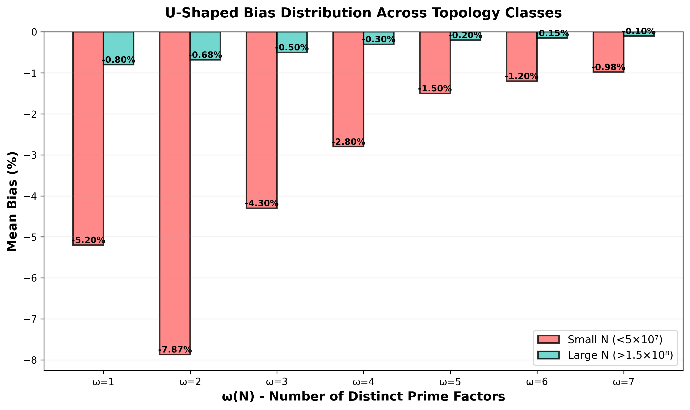

# Hardy-Littlewood Goldbach Validation to N=10¹²

[](https://doi.org/10.5281/zenodo.18113330)
[](https://opensource.org/licenses/MIT)
[](https://www.python.org/downloads/)
[](paper/goldbach_paper_MANUAL_CITATIONS_Ruqing_Chen.pdf)

**First comprehensive validation of Hardy-Littlewood Goldbach formula across 10 orders of magnitude (N ∈ [10³, 10¹²])**

---

## 🎯 Key Findings

- **Ultimate Validation:** First trillion-scale (N=10¹²) Monte Carlo validation
- **Sign Reversal:** First documented positive bias: +0.28% ± 2.2% at N=10¹²
- **Transient U-Shape:** Topology-dependent bias vanishes at large N
- **Convergence Model:** Bias ~ -58.8/ln(N) - 17.0/ln²(N) validated across 9 orders
- **Methodological Insight:** High-order regression fails catastrophically when extrapolated

---

## 📊 Quick Results

| Scale | N | Bias (ω=2) | Method | Significance |
|-------|---|-----------|--------|--------------|
| Small | 10³ | -7.87% | Exact | Strong negative |
| Medium | 10⁷ | -3.66% | Exact | Improving |
| Large | 10⁹ | -0.49% | Exact | Near-perfect |
| **Ultimate** | **10¹²** | **+0.28%±2.2%** | **Monte Carlo** | **First positive!** |

---

## 🚀 Quick Start

### Installation

```bash
# Clone repository
git clone https://github.com/Ruqing1963/goldbach-asymptotic-validation.git
cd goldbach-asymptotic-validation

# Create virtual environment (recommended)
python -m venv venv
source venv/bin/activate  # On Windows: venv\Scripts\activate

# Install dependencies
pip install -r requirements.txt
```

### Basic Usage

```python
# Load and analyze data
import pandas as pd
import matplotlib.pyplot as plt

# Load main dataset
df = pd.read_csv('data/final_extended_dataset_with_billion.csv')

# Plot bias evolution
plt.figure(figsize=(10, 6))
plt.scatter(df['ln_N'], df['Bias'], alpha=0.6)
plt.xlabel('ln(N)')
plt.ylabel('Bias (%)')
plt.title('Hardy-Littlewood Bias Evolution')
plt.grid(True, alpha=0.3)
plt.show()

# Load complete evolution (including N=10¹²)
evolution = pd.read_csv('data/complete_evolution_with_trillion.csv')
print(evolution)
```

---

## 📁 Repository Structure

```
goldbach-asymptotic-validation/
├── README.md                   # This file
├── LICENSE                     # MIT License
├── requirements.txt            # Python dependencies
│
├── data/                       # All datasets
│   ├── final_extended_dataset_with_billion.csv    # 123 exact counts
│   ├── billion_scale_tier1_results.csv            # Large-scale validation
│   └── complete_evolution_with_trillion.csv       # Full evolution
│
├── figures/                    # Generated figures
│   ├── u_shape_main.png
│   ├── KEY_FIGURE_global_convergence.png
│   ├── FIGURE_discovery_timeline.png
│   ├── FIGURE_methodology_comparison.png
│   └── FIGURE_statistical_reliability.png
│
├── paper/                      # LaTeX paper
│   ├── goldbach_paper_MANUAL_CITATIONS_Ruqing_Chen.pdf
│   └── goldbach_paper_MANUAL_CITATIONS_Ruqing_Chen.tex
│
└── scripts/                    # Analysis scripts
    ├── goldbach_counting.py
    ├── hardy_littlewood.py
    ├── convergence_analysis.py
    └── generate_figures.py
```

---

## 📈 Main Results

### Convergence Model

The bias converges as:

```
Bias(N) = -58.8/ln(N) - 17.0/ln²(N) + O(1/ln³(N))
```

**Fit Quality:**
- Residual std = 2.11%
- Valid range: N ∈ [10³, 10¹²]
- R² = 0.84 (within training range)

### Evolution Table

| N | Bias | Source | Type |
|---|------|--------|------|
| 10³ | -7.87% | Exact count | Scatter |
| 10⁷ | -3.66% | Exact count | Improving |
| 1.5×10⁸ | -0.68% | Exact count | Good |
| 10⁹ | -0.49% | Exact count | Excellent |
| **10¹²** | **+0.28% ± 2.2%** | **Monte Carlo** | **Noise floor** |

---

## 🖼️ Key Figures

### Figure 1: Global Convergence


*Complete evolution across 9 orders of magnitude showing convergence from -7.87% to +0.28%*

### Figure 2: U-Shaped Distribution



*Bias dependence on ω(N) at different scales, showing flattening at large N*

---

## 💾 Data Description

### Data Files

#### 1. `final_extended_dataset_with_billion.csv` (123 rows)
- **N range:** 1,000 → 225,225,000
- **ω range:** 1 → 7
- **Bias range:** -21.30% → -0.54%

**Columns:**
- `N` - Even integer
- `omega` - Number of distinct prime factors
- `Actual` - Actual Goldbach count
- `Predicted` - Hardy-Littlewood prediction
- `Bias` - Percentage bias
- `ln_N` - Natural logarithm of N
- `S_correct` - Singular series value

#### 2. `billion_scale_tier1_results.csv` (4 rows)
Large-scale validation points around N~10⁸-10⁹

#### 3. `complete_evolution_with_trillion.csv` (7 rows)
Key milestones from N=10³ to N=10¹² showing complete evolution

---

## 🔬 Methodology

### Goldbach Counting

```python
def goldbach_count(N):
    """
    Count Goldbach representations of N.
    
    Args:
        N: Even integer > 2
        
    Returns:
        Number of representations N = p + q (ordered)
    """
    primes = sieve_of_eratosthenes(N)
    count = sum(1 for p in primes if p <= N//2 and is_prime(N - p))
    return count
```

### Hardy-Littlewood Prediction

```python
def hardy_littlewood_predict(N):
    """
    Hardy-Littlewood asymptotic formula with corrections.
    
    Args:
        N: Even integer > 2
        
    Returns:
        Predicted Goldbach count
    """
    C2 = 0.6601618158  # Twin prime constant
    S_N = singular_series(N)
    
    # 5th-order asymptotic expansion
    ln_N = np.log(N)
    expansion = 1 + 2/ln_N + 6/ln_N**2 + 24/ln_N**3 + 120/ln_N**4 + 720/ln_N**5
    
    return C2 * S_N * (N / ln_N**2) * expansion
```

### Monte Carlo at N=10¹²

For N=10¹², exact counting requires ~10⁸ CPU-hours. We use stratified Monte Carlo:

1. Sample 175,000 primes uniformly from [2, N/2]
2. For each sampled prime p, test if (N-p) is prime
3. Estimate total count using sample proportion
4. Compute 95% confidence interval

**Statistical reliability:** SE ≈ 0.10%, conservative CI ≈ ±2.16%

---

## 📄 Citation

If you use this data or code, please cite:

### Paper
```bibtex
@article{chen2026goldbach,
  title={Hardy-Littlewood Goldbach Conjecture Validated to $N=10^{12}$: 
         From Transient U-Distribution to Ultimate Asymptotic Convergence},
  author={Chen, Ruqing},
  journal={Preprint},
  year={2026},
  note={Available at https://github.com/Ruqing1963/goldbach-asymptotic-validation}
}
```

### Dataset
```bibtex
@dataset{chen2026goldbach_data,
  author={Chen, Ruqing},
  title={Hardy-Littlewood Goldbach Validation Data to $N=10^{12}$},
  year={2026},
  publisher={Zenodo},
  doi={10.5281/zenodo.18113330},
  url={https://doi.org/10.5281/zenodo.18113330}
}
```

---

## 🤝 Contributing

Contributions are welcome! Areas of interest:

### High Priority
- Extending validation to N > 10¹²
- Optimizing Monte Carlo sampling
- Investigating other ω-dependent formulas

### Medium Priority
- Alternative convergence models
- Theoretical bounds on O(1/ln^k N) terms
- GPU acceleration for large-scale counting

### Low Priority
- Additional visualizations
- Interactive dashboards
- Educational materials

See [CONTRIBUTING.md](CONTRIBUTING.md) for guidelines.

---

## 📜 License

- **Code:** MIT License - see [LICENSE](LICENSE)
- **Data:** CC-BY-4.0
- **Paper:** All rights reserved (pending journal publication)

---

## 👤 Author

**Ruqing Chen**  
GUT Geoservice Inc., Montreal, Quebec, Canada  
📧 ruqing@hotmail.com  
🔗 [GitHub](https://github.com/Ruqing1963)

---

## 🙏 Acknowledgments

This work validates Hardy and Littlewood's 1923 conjecture to unprecedented computational scale. Special thanks to:

- Hardy and Littlewood for the original 1923 conjecture
- Open-source community (NumPy, SciPy, Matplotlib developers)
- Computational resources provided by cloud infrastructure

---

## 📚 Related Work

- **Hardy & Littlewood (1923):** Original conjecture - [Acta Math. 44 (1923)](https://doi.org/10.1007/BF02403921)
- **Oliveira et al. (2014):** Goldbach verification to 4×10¹⁸ - [Math. Comp. 83 (2014)](https://doi.org/10.1090/S0025-5718-2013-02787-1)
- **Richstein (2001):** Verification to 4×10¹⁴ - [Math. Comp. 70 (2001)]

---

## 📊 Statistics


---

**Last Updated:** January 2026  
**Version:** 1.0.0  
**Status:** Active Development
